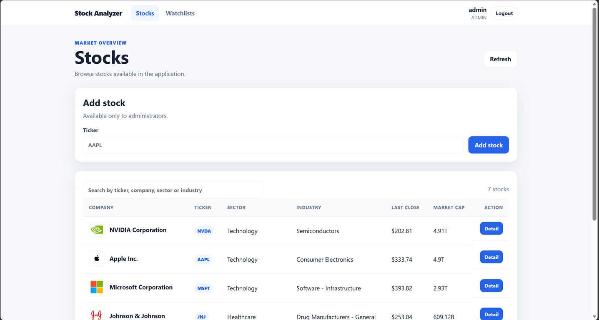
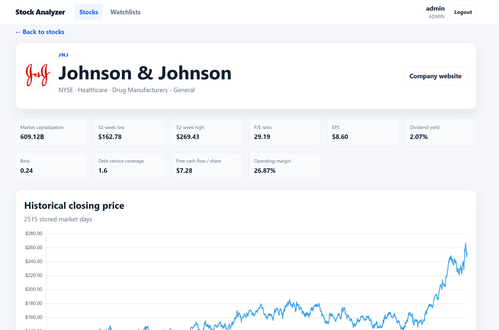
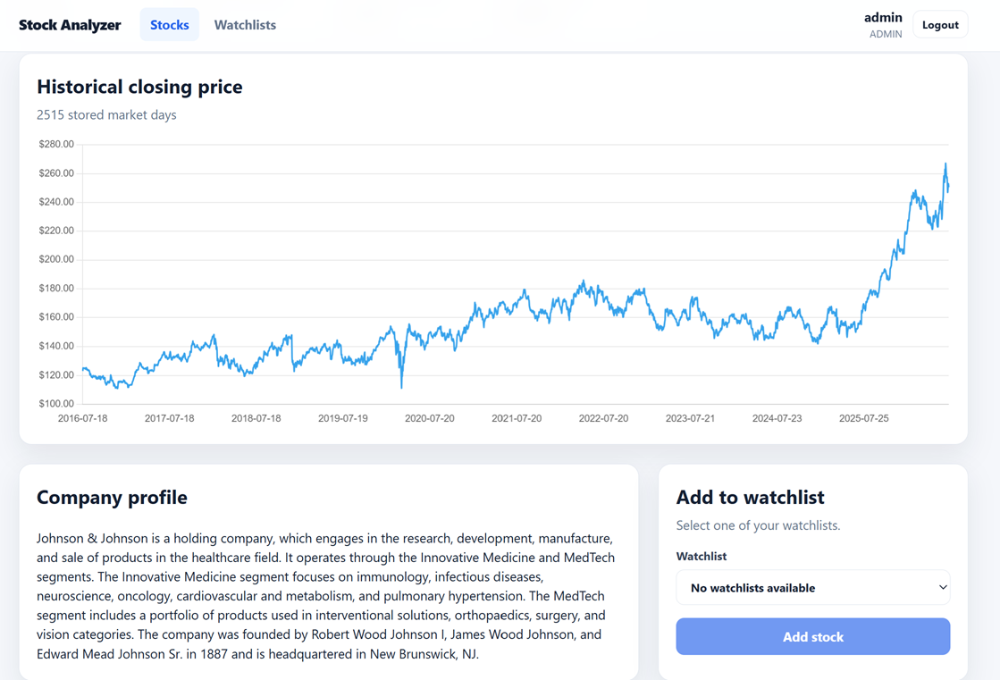
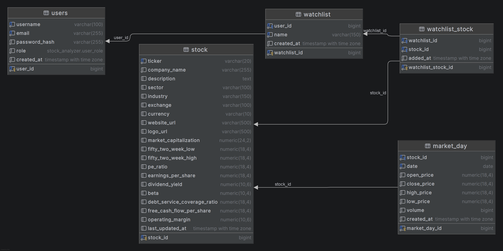

# Stock Analyzer

Web application for browsing stocks, viewing fundamental and historical market data, and organizing selected stocks into personal watchlists.

The application retrieves financial data from Financial Modeling Prep, stores it in PostgreSQL, and periodically refreshes outdated stock and market data.

## Run the Application

The recommended way to run the application is via Docker.

Create a local `.env` file from `.env.example` and fill in the required values, especially:

- `ADMIN_PASSWORD`
- `FMP_API_KEY`
- `JWT_SECRET`

Then build and start the application:

```bash
docker compose up --build
```

The application will be available at:

```text
http://localhost:8080
```

PostgreSQL will be available at:

```text
localhost:5432
```

### Initial Administrator

When the application starts, it creates an administrator account if no administrator exists yet.

The credentials are configured in the `.env` file:

| Role  | Username variable | Email variable | Password variable |
|-------|-------------------|----------------|-------------------|
| ADMIN | `ADMIN_USERNAME`  | `ADMIN_EMAIL`  | `ADMIN_PASSWORD`  |

The values from `.env.example` are intended only as a configuration template. Replace the default password before starting the application.

Changing these variables later does not automatically update an administrator that already exists in the database.


## Configuration Notes

Use `.env.example` as a template for creating your local `.env` file.

### Financial Data API

The application uses Financial Modeling Prep as its external financial-data provider. A valid API key must be supplied through:

```env
FMP_API_KEY=your_api_key
```

### JWT Secret

The JWT signing secret must be at least 32 characters long:

```env
JWT_SECRET=your_secret
```

A secret suitable for local development can be generated with:

```bash
openssl rand -base64 32
```

### Database Initialization

The PostgreSQL container executes initialization scripts from the `database/` directory when the database volume is created for the first time.

The application uses Hibernate schema validation, so the expected database schema must already exist.

PostgreSQL initialization variables are also applied only when the Docker volume is created for the first time. To recreate the database:

```bash
docker compose down -v
docker compose up --build
```

> **Warning:** This permanently deletes all data stored in the Docker volume.

### Scheduled Data Refresh

Scheduled stock-data updates use the `Europe/Prague` time zone.

By default:

- market-day data refresh runs daily at 7:00
- stock details refresh runs daily at 7:30
- at most 100 stocks are refreshed in one stock-data update

These values can be changed in `application.properties`.

## Main Features

- user registration and JWT-based authentication
- role-based authorization for users and administrators
- browsing and searching available stocks
- detailed company profiles and fundamental indicators
- historical closing-price charts
- personal watchlists
- administrative stock management
- scheduled financial-data refresh

## Application Screenshots

### Stock Overview

The stock overview supports searching by ticker, company name, sector, or industry. Administrators can also add stocks.



### Stock Detail

The stock detail page displays the company profile, fundamental indicators, historical closing prices, and watchlist actions.





### Database Schema

The following entity-relationship diagram shows the PostgreSQL tables, primary and foreign keys, and relationships between users, watchlists, stocks, and historical market days.



## Database Model

The main database entities are:

- `users` – registered users and their roles
- `watchlist` – user-created watchlists
- `stock` – company information and fundamental stock data
- `market_day` – historical daily market data
- `watchlist_stock` – association between watchlists and stocks